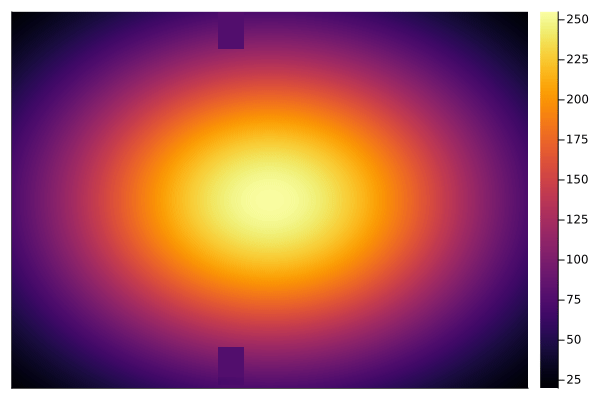

# 2-D Fluid Simulator

## *Mostly from scratch*


This repository is a project to build a fluid simulator to give myself experience with the following:

- Simulation (currently fluids - aspiring to plasma sims)
- Numerical Linear Algebra
- Parallel Programming applied to the above
- Making pretty visuals

I also have somewhat always been interested in what the optimimum (minimum energy) needed
to stir coffee and milk together. Perhaps one day I'll get some recurrent neural net working
with a coffee mug, spoon, and multi-fluid sim. Until then,
my primary goal is to get hands-on practice numerical linear algebra routines (serial and parallel).
Since I'm programming using [Metal.jl](https://github.com/JuliaGPU/Metal.jl), I'll need
to pause and work on implementing necessary GPU components for use in this project.

## TODO

- ~~Compare effect of number of solver iterations~~
- Jacobi
    - ~~CPU Jacobi Solver~~
    - GPU Jacobi Solver
    - Benchmark/Compare
- Gauss-Siedel
    - CPU
    - GPU
    - Benchmark/Compare
- Add MPS Solver Support to Metal.jl
    - Compare performance of Metal Performance Shaders
- Add diffusion
- Interactive Sim (in Pluto?)
- Expand to 3D Sim


## Effect Number of Iterations has on Simulation

The below gifs show the same simulation setup but with varying number of iterations for the pressure solver. The following number of iterations were used (in order of the gifs): 100, 300, 500, 800, 1500, 2000.





## Heatmap Plotting Comparison - Plots vs GLMakie

After realizing how slow Plots.jl was at plotting heatmaps, I looked into GLMakie and found it faster (~27x for 2048x2048 Float32 matrices).

Plots:
```julia
BenchmarkTools.Trial: 2 samples with 1 evaluation.
 Range (min … max):  2.524 s …    2.770 s  ┊ GC (min … max): 7.05% … 5.98%
 Time  (median):     2.647 s               ┊ GC (median):    6.49%
 Time  (mean ± σ):   2.647 s ± 174.051 ms  ┊ GC (mean ± σ):  6.49% ± 0.75%

  █                                                        █
  █▁▁▁▁▁▁▁▁▁▁▁▁▁▁▁▁▁▁▁▁▁▁▁▁▁▁▁▁▁▁▁▁▁▁▁▁▁▁▁▁▁▁▁▁▁▁▁▁▁▁▁▁▁▁▁▁█ ▁
  2.52 s         Histogram: frequency by time         2.77 s <

 Memory estimate: 2.64 GiB, allocs estimate: 50339595.
```

GLMakie:
```julia
BenchmarkTools.Trial: 52 samples with 1 evaluation.
 Range (min … max):  93.946 ms … 104.816 ms  ┊ GC (min … max): 0.00% … 9.04%
 Time  (median):     94.411 ms               ┊ GC (median):    0.00%
 Time  (mean ± σ):   96.213 ms ±   3.854 ms  ┊ GC (mean ± σ):  1.85% ± 3.56%

   █▃▁
  ▆███▄▄▁▁▁▁▁▁▁▁▁▁▁▁▁▁▁▁▁▁▁▁▁▁▁▁▁▁▁▁▁▁▁▁▁▁▁▁▃▁▁▁▁▁▁▁▃▁▁▁▁▁▃▄▄▄ ▁
  93.9 ms         Histogram: frequency by time          105 ms <

 Memory estimate: 57.21 MiB, allocs estimate: 123119.
```